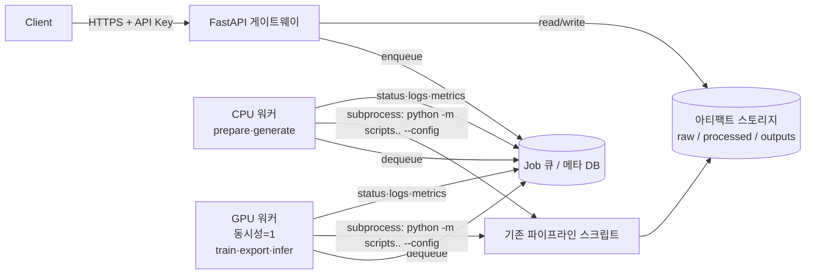

# 지식 파이프라인 API 설계 문서

이 문서는 현재 CLI 기반 파이프라인(데이터 준비 · 생성 · 학습 · 병합 · 테스트)을
**HTTP API**로 제공하기 위한 설계안입니다. 구현 전에 합의할 아키텍처·리소스·엔드포인트를
정리합니다. (구현은 아직 하지 않습니다.)

- 상태: **초안(Draft)** — 리뷰 후 확정. **Phase 1(MVP)은 [`api/`](../api/)에 구현됨**
  (실행법: [api/README.md](../api/README.md)).
- 대상 독자: 이 파이프라인을 서비스/자동화에 붙이려는 개발자
- 관련 문서: [meta_info.md](meta_info.md) · [tool_calling.md](tool_calling.md) ·
  [planning.md](planning.md) · [react.md](react.md) · [planact.md](planact.md)

---

## 1. 가능한가? — 결론

**가능합니다.** 현재 구조가 API화에 유리합니다.

- 모든 기능이 `--config`로 동작하는 **독립 스크립트**입니다 → API는 요청마다 config를
  생성해 스크립트를 **서브프로세스로 실행**하면 됩니다(스크립트 재작성 불필요).
- 입력은 파일(`data/raw/`), 출력은 아티팩트(`outputs/`, `data/processed/`)로 명확히 분리됩니다.
- 단계(stage) 개념(`cpt/sft/tool/plan/react/planact/dpo/orpo/kto`)이 이미 표준화되어 있어
  엔드포인트 파라미터로 그대로 노출할 수 있습니다.

### 핵심 제약 (설계를 좌우하는 요소)

| 제약 | 영향 | 설계 대응 |
|---|---|---|
| 학습/생성은 수 분~수 시간 소요 | 동기 HTTP 불가 | **비동기 Job** + 폴링/스트리밍 |
| GPU는 동시에 1개 학습만 | 병렬 학습 불가 | **GPU 잡 큐(동시성 1)** |
| unsloth import가 무겁고 프로세스 전역 상태 | 한 프로세스에서 반복 로드 위험 | **잡마다 서브프로세스**로 격리 |
| 데이터 생성은 외부 LLM API 키 필요 | 비밀정보 취급 | **프로젝트 시크릿**(암호화·미로깅) |
| 산출물(모델)이 수 GB | 응답 본문 부적합 | **아티팩트 스토리지 + 다운로드 URL** |

---

## 2. 목표 / 비목표

**목표 (v1)**
- 원문/QA/툴/계획/ReAct/계획-실행 데이터 **업로드 · 준비 · (LLM)생성**
- 각 단계 **학습**(CPT/SFT/tool/plan/react/planact/DPO/ORPO/KTO) 잡 실행·모니터링
- 어댑터 **병합/내보내기**(16bit/GGUF)
- 학습 결과 **간이 추론 테스트**
- 잡 상태·로그·메트릭 조회, 아티팩트 다운로드

**비목표 (v1, 이후 단계로)**
- 고성능 상시 서빙(vLLM 배포 엔드포인트) — §11 Phase 2
- 멀티테넌시/과금/쿼터 정교화
- 분산·멀티노드 학습 오케스트레이션
- 웹 UI(콘솔) — API 우선

---

## 3. 아키텍처



### 3.1 실행 모델 — 왜 서브프로세스인가

API는 요청 파라미터로 **잡별 config.yaml을 생성**하고, 기존 스크립트를 서브프로세스로 실행합니다.

```
POST /train {stage:"sft", overrides:{...}}
  → 잡 생성 → {job_dir}/config.yaml 작성(프로젝트 경로 + 기본값 + overrides 병합)
  → subprocess: python -m scripts.train.train_sft --config {job_dir}/config.yaml
  → stdout 캡처 → 로그 저장 + "[OK] ... loss: X" 파싱 → 메트릭
  → 종료코드로 성공/실패 판정, outputs/sft/final 을 아티팩트로 등록
```

장점: 스크립트 무수정 재사용 · unsloth 전역상태 격리 · `SIGTERM`으로 취소 가능 ·
CLI와 동작 100% 일치. (대안: 함수 직접 import → 프로세스 재사용 이점이 있으나 GPU
메모리 누수·전역상태 문제로 v1에서는 채택하지 않음.)

### 3.2 워커 / 동시성

- **GPU 워커**: 동시성 **1**(설정 가능). `train_*`, `export_model`, `infer`가 여기서 직렬 실행.
- **CPU 워커**: 동시성 N. `prepare_data`(순수 파이썬), `generate_*`(외부 LLM 호출, I/O 대기)는 GPU 불필요 → 별도 풀에서 병렬.
- 큐 구현: v1은 **DB 기반 경량 큐 + 워커 프로세스**(SQLite/Postgres). 스케일아웃 시 Celery/RQ+Redis로 교체(§11).

### 3.3 스토리지 레이아웃

프로젝트 단위로 격리(기존 레포 구조를 그대로 프로젝트 하위에 매핑):

```
{STORAGE_ROOT}/{project_id}/
├── raw/                     # 업로드 원문·jsonl (data/raw 대응)
├── processed/               # 준비된 데이터셋 (data/processed 대응)
├── outputs/                 # 어댑터·병합모델 (outputs 대응)
├── jobs/{job_id}/           # 잡별 config.yaml · logs · 메트릭
└── secrets.enc              # LLM API 키 등(암호화)
```

---

## 4. 리소스 모델

| 리소스 | 설명 | 식별자 |
|---|---|---|
| **Project** | 하나의 작업공간(raw/데이터셋/어댑터 묶음) | `project_id` |
| **RawFile** | 업로드된 원문/jsonl | `file_id` (또는 파일명) |
| **Dataset** | 준비된 학습 데이터셋(kind별) | `kind` (cpt/sft/tool/plan/react/planact/pref/kto) |
| **Job** | 비동기 작업(prepare/generate/train/export/infer) | `job_id` |
| **Adapter** | 학습 산출 LoRA 어댑터(stage별) | `stage` |
| **Model** | 병합된 16bit/GGUF 모델 | `model_id` |
| **Secret** | 프로젝트 시크릿(LLM 키 등) | key 이름 |

### Job 상태 머신

```
queued → running → (succeeded | failed | canceled)
```

Job 객체(공통):
```json
{
  "job_id": "job_01H...",
  "project_id": "proj_abc",
  "type": "train",                 // prepare | generate | train | export | infer
  "status": "running",             // queued | running | succeeded | failed | canceled
  "params": { "stage": "sft", "overrides": {} },
  "progress": { "step": 120, "total_steps": 400, "loss": 1.83 },
  "result": { "adapter": {"stage":"sft"}, "metrics": {"train_loss": 1.42} },
  "error": null,
  "created_at": "2026-07-26T12:00:00Z",
  "started_at": "2026-07-26T12:00:03Z",
  "finished_at": null,
  "logs_url": "/v1/jobs/job_01H.../logs"
}
```

---

## 5. 공통 규약

- 베이스 경로: `/v1`
- 인증: `Authorization: Bearer <API_KEY>` (§9)
- 콘텐츠: `application/json` (파일 업로드만 `multipart/form-data`)
- 비동기 작업은 **`202 Accepted` + Job 객체** 반환. 결과는 잡 조회/스트림으로 확인.
- 멱등성: 변경 요청에 `Idempotency-Key` 헤더 지원(중복 잡 생성 방지).
- 시간: RFC3339(UTC). 페이지네이션: `?limit=&cursor=`.
- OpenAPI 3.1 문서 자동 제공(`/v1/openapi.json`, `/v1/docs`).

### 에러 모델
```json
{ "error": { "code": "invalid_argument", "message": "steps는 2개 이상이어야 합니다",
             "details": {"field": "plan"} } }
```
| HTTP | code | 예 |
|---|---|---|
| 400 | `invalid_argument` | 잘못된 stage/파라미터 |
| 401 | `unauthenticated` | API 키 없음/무효 |
| 404 | `not_found` | 프로젝트/잡 없음 |
| 409 | `conflict` | 어댑터 없음(선행 단계 미완), 잡 중복 |
| 422 | `unprocessable` | 데이터 검증 실패(형식 오류) |
| 429 | `resource_exhausted` | GPU 큐 한도 초과 |
| 500 | `internal` | 서버 오류 |

---

## 6. 엔드포인트 요약

| 그룹 | 메서드 · 경로 | 설명 | 동기? |
|---|---|---|---|
| 프로젝트 | `POST /v1/projects` | 프로젝트 생성 | 동기 |
| | `GET /v1/projects` / `GET /v1/projects/{pid}` | 목록/조회 | 동기 |
| | `DELETE /v1/projects/{pid}` | 삭제 | 동기 |
| 시크릿 | `PUT /v1/projects/{pid}/secrets` | LLM 키 등 저장 | 동기 |
| 파일 | `POST /v1/projects/{pid}/raw-files` | 원문/jsonl 업로드 | 동기 |
| | `GET /v1/projects/{pid}/raw-files` | 업로드 목록 | 동기 |
| | `DELETE /v1/projects/{pid}/raw-files/{name}` | 삭제 | 동기 |
| 데이터 준비 | `POST /v1/projects/{pid}/datasets:prepare` | raw → 데이터셋 6종 | **잡** |
| 데이터 생성 | `POST /v1/projects/{pid}/datasets:generate` | LLM으로 데이터 생성 | **잡** |
| 데이터 조회 | `GET /v1/projects/{pid}/datasets` | 데이터셋·통계 | 동기 |
| | `GET /v1/projects/{pid}/datasets/{kind}?sample=` | 샘플/다운로드 | 동기 |
| 학습 | `POST /v1/projects/{pid}/train` | 단계 학습 | **잡** |
| 병합 | `POST /v1/projects/{pid}/export` | 어댑터 병합(16bit/GGUF) | **잡** |
| 추론 | `POST /v1/projects/{pid}/infer` | 간이 추론 테스트 | **잡**(짧음) |
| 어댑터/모델 | `GET /v1/projects/{pid}/adapters` | 어댑터 목록 | 동기 |
| | `GET /v1/projects/{pid}/models` | 병합모델 목록 | 동기 |
| | `GET .../models/{id}:download` | 모델 다운로드 URL | 동기 |
| 잡 | `GET /v1/jobs/{job_id}` | 상태·메트릭 | 동기 |
| | `GET /v1/jobs/{job_id}/logs?follow=true` | 로그(SSE 스트림) | 스트림 |
| | `POST /v1/jobs/{job_id}:cancel` | 취소 | 동기 |
| | `GET /v1/projects/{pid}/jobs` | 잡 목록 | 동기 |
| 메타 | `GET /v1/config/schema` | 기본 config·override 스키마 | 동기 |

> 표기: `:action`은 REST 리소스에 대한 커스텀 액션(구글 AIP 스타일). 예:
> `POST /v1/projects/{pid}/datasets:prepare`.

---

## 7. 엔드포인트 상세

### 7.1 프로젝트

**`POST /v1/projects`**
```json
// 요청
{ "name": "asteria-lore", "base_model": "unsloth/Qwen2.5-7B-Instruct-bnb-4bit",
  "chat_template": "qwen-2.5" }
// 201
{ "project_id": "proj_abc", "name": "asteria-lore", "created_at": "..." }
```
프로젝트 생성 시 기본 `config.yaml`을 스토리지에 복사하고, 이후 잡의 override는 이 위에 병합됩니다.

**`GET /v1/projects/{pid}`** → 프로젝트 메타 + 보유 데이터셋/어댑터 요약.
**`DELETE /v1/projects/{pid}`** → 스토리지 전체 삭제(비가역, 확인 파라미터 `?confirm=true`).

---

### 7.2 시크릿 (LLM 생성용 키)

**`PUT /v1/projects/{pid}/secrets`**
```json
{ "QA_GEN_BASE_URL": "http://vllm:8000/v1", "QA_GEN_MODEL": "qwen2.5:14b",
  "QA_GEN_API_KEY": "sk-..." }
// 204 (본문 없음; 값은 암호화 저장, 응답·로그에 절대 노출 안 함)
```
생성 잡 실행 시 이 값들이 서브프로세스 환경변수로 주입됩니다(요청 본문에 매번 넣는 방식도 지원 — §7.5).

---

### 7.3 파일 업로드

**`POST /v1/projects/{pid}/raw-files`** (`multipart/form-data`)
- `file`: 업로드 파일
- `kind`(선택): `doc | qa | tools | plans | react | planact` — 저장 파일명 규칙 매핑
  (예: `kind=tools` → `raw/tools_<원본이름>.jsonl`; `doc` → `raw/*.md/.txt`)

```json
// 201
{ "name": "tools_myapi.jsonl", "kind": "tools", "bytes": 20481, "lines": 128 }
```
- 검증: 확장자·크기 상한·(jsonl이면) 라인 파싱 여부. 형식 위반은 `422`.
- 목록/삭제: `GET`, `DELETE .../raw-files/{name}`.

---

### 7.4 데이터 준비

**`POST /v1/projects/{pid}/datasets:prepare`**
```json
// 요청 (본문 선택 — override)
{ "overrides": { "data": { "chunk_size": 1500, "chunk_overlap": 150 } } }
// 202 → Job(type=prepare)
```
- 동작: `raw/`의 `*.md/.txt`, `qa_*/tools_*/plans_*/react_*/planact_*.jsonl`을
  스캔해 `prepare_data.py` 실행 → 6종 데이터셋 생성.
- 결과: `result.datasets = [{kind, count, path}]` (건너뛴 라인 수 포함).
- 원문이 하나도 없으면 스크립트가 샘플을 생성하는 기존 동작을 따름(옵션으로 비활성 가능:
  `{"no_sample": true}`).

---

### 7.5 데이터 생성 (LLM)

**`POST /v1/projects/{pid}/datasets:generate`**
```json
// 요청
{
  "kind": "tool",                    // qa | tool | plan | react | planact | preference
  "params": { "per_chunk": 2, "max_chunks": 50, "overwrite": false,
              "tools_catalog_file": "tools_catalog.json" },
  "llm": {                            // 생략 시 프로젝트 시크릿(§7.2) 사용
    "base_url": "http://vllm:8000/v1", "model": "qwen2.5:14b", "api_key": "sk-..."
  }
}
// 202 → Job(type=generate)
```
- 매핑: `kind` → `generate_{qa,tool_calls,plans,react,planact}.py` / `generate_preference.py`.
- `llm`은 서브프로세스에 `QA_GEN_*` 환경변수로 주입(응답/로그 미노출).
- 결과: `result = {kind, appended, dataset_path}`; 생성분은 `meta.origin="llm:<model>"`로 표기.

> ⚠️ 생성 데이터는 사람이 표본 검수해야 함을 응답 `warnings`에 명시(각 docs 링크 포함).

---

### 7.6 학습

**`POST /v1/projects/{pid}/train`**
```json
// 요청
{
  "stage": "sft",                    // cpt|sft|tool|plan|react|planact|dpo|orpo|kto
  "overrides": {                     // config.yaml의 해당 stage 하위를 덮어씀
    "sft": { "train": { "num_epochs": 3, "learning_rate": 2.0e-4 },
             "continue_from_cpt": true } }
}
// 202
{ "job_id": "job_...", "type": "train", "status": "queued",
  "params": {"stage":"sft"}, "logs_url": "/v1/jobs/job_.../logs" }
```
- 선행 조건 검증: `sft(continue_from_cpt)`→cpt 어댑터, `dpo/planact(init_from)`→해당 어댑터 존재.
  없으면 `409 conflict`.
- 진행률: stdout의 `loss`/step 로그를 파싱해 `progress`에 반영. 완료 시 `result.metrics.train_loss`.
- 산출물: `outputs/{stage}/final` 어댑터가 Adapter 리소스로 등록.
- GPU 큐에서 직렬 실행. 큐 한도 초과 시 즉시 `202`(queued)로 대기.

---

### 7.7 병합/내보내기

**`POST /v1/projects/{pid}/export`**
```json
// 요청
{ "stage": "planact", "save_gguf": true, "gguf_quantization": "q4_k_m" }
// 202 → Job(type=export) → result: { model_id, merged_dir, gguf_dir? }
```
- 어댑터 없으면 `409`. 산출물은 Model 리소스로 등록, 다운로드 URL 제공.

---

### 7.8 추론(간이 테스트)

**`POST /v1/projects/{pid}/infer`**
```json
// 요청
{
  "stage": "planact",               // 어떤 어댑터로 추론할지
  "messages": [{"role":"user","content":"코어스톤 위기 대응 계획 세워줘"}],
  // 또는 "question": "..."
  "tools": [ ... ],                  // tool/planact일 때(생략 시 데이터셋 첫 tools 사용)
  "max_new_tokens": 512, "temperature": 0.3
}
// 202 → Job(type=infer) → result: { "text": "...", "stage": "planact" }
```
- 어댑터 로드가 비싸므로 v1은 **짧은 잡**으로 처리(GPU 워커). 결과는 잡 조회로 수령.
- system 프롬프트는 학습 때 값과 일치시키기 위해 config에서 자동 적용(불일치 방지).
- 상시 저지연 서빙이 필요하면 Phase 2의 **Deployment**(vLLM) 사용(§11).

---

### 7.9 잡 관리

**`GET /v1/jobs/{job_id}`** → §4의 Job 객체.

**`GET /v1/jobs/{job_id}/logs?follow=true`**
- `follow=false`: 현재까지의 로그 텍스트.
- `follow=true`: **SSE 스트림**(`text/event-stream`)으로 실시간 로그 라인 전송.
  ```
  event: log
  data: {"ts":"...","line":"[i] SFT 학습 샘플 수: 152"}

  event: status
  data: {"status":"succeeded"}
  ```

**`POST /v1/jobs/{job_id}:cancel`** → 서브프로세스에 `SIGTERM`, 상태 `canceled`.
**`GET /v1/projects/{pid}/jobs?status=&type=`** → 잡 목록(필터·페이지네이션).

**완료 알림(선택)**: 잡 생성 시 `callback_url`을 주면 종료 시 POST 웹훅 전송
(`{job_id, status, result}`). 폴링 대신 사용.

---

### 7.10 어댑터 / 모델 / 스키마

- **`GET /v1/projects/{pid}/adapters`** → `[{stage, path, created_at, metrics}]`.
- **`GET /v1/projects/{pid}/models`** → 병합모델 목록.
- **`GET /v1/projects/{pid}/models/{id}:download`** → 서명된 다운로드 URL(대용량 → 스토리지 직접).
- **`GET /v1/config/schema`** → 기본 `config.yaml` + override 가능한 필드 스키마(클라이언트 검증용).

---

## 8. Config Override 규약

요청의 `overrides`는 프로젝트 기본 `config.yaml`에 **깊은 병합(deep-merge)**됩니다.
경로(dataset/output_dir 등)는 API가 **프로젝트 스토리지 기준으로 강제 주입**하므로
클라이언트가 임의 경로를 지정할 수 없습니다(경로 탈출 방지).

```
최종 config = 기본 config
              ⊕ 프로젝트 설정(model.name, chat_template 등)
              ⊕ 서버 주입 경로(data.*, *.output_dir, export.merged_dir)
              ⊕ 요청 overrides(허용된 필드만)
```
허용 필드 화이트리스트로 검증(예: `*.train.*`, `*.lora.*`, `data.chunk_*`,
`sft.system_prompt`, `export.save_gguf` 등). 경로류 필드는 무시/거부.

---

## 9. 인증 · 보안

- **인증**: API 키(`Authorization: Bearer`). 키별 프로젝트 스코프.
- **시크릿**: LLM API 키는 저장 시 암호화(KMS/envelope), 응답·로그·에러에 **절대 미출력**.
- **격리**: 프로젝트별 스토리지 분리, config 경로 서버 주입으로 경로 탈출 차단.
- **업로드 안전성**: 확장자·크기 상한·라인수 제한, jsonl 파싱 검증.
- **GPU DoS 방지**: 프로젝트별 동시 잡 수·큐 길이·일일 잡 수 쿼터.
- **취소/정리**: 취소·실패 잡의 부분 체크포인트 정리 정책(보존/삭제) 설정.
- **감사 로그**: 잡 생성·삭제·다운로드 기록.

---

## 10. 관측성

- 잡별 로그 파일 + SSE 스트림.
- 메트릭: 잡 처리시간, GPU 큐 대기시간, 성공/실패율, 단계별 train_loss.
- 헬스체크: `GET /v1/healthz`(API), `GET /v1/readyz`(GPU/워커 가용성).
- ✅ **구조화 메트릭 (`--report-json`)**: 모든 스크립트가 완료 후 결과를 JSON으로
  기록하며(`scripts/lib/common.py`의 `add_report_arg`/`write_report`), API 러너가
  잡별 `report.json`을 읽어 `result`를 구성한다(리포트 우선, 없으면 stdout 폴백).
  원격 실행 시 리포트도 함께 회수한다.

---

## 11. 배포 · 확장 · 단계

**배포(v1)**: 단일 GPU 노드. `api`(FastAPI/uvicorn) + `cpu-worker` + `gpu-worker`
3개 프로세스, 공유 스토리지(로컬 볼륨) + 메타 DB(SQLite→Postgres).

> **unsloth(GPU)가 원격 호스트일 때**의 배포(원격 GPU 워커 / SSH 러너 / 관리형
> 스케줄러)는 [remote_unsloth.md](remote_unsloth.md)에 별도 정리되어 있습니다.

**Phase 구분**
- **Phase 1 (MVP)**: 프로젝트·파일·prepare·generate·train·export·jobs·infer(잡).
- **Phase 2**: 상시 서빙 **Deployment**(어댑터 병합모델을 vLLM로 로드, `POST /deployments`,
  `POST /deployments/{id}/chat` 저지연 추론, OpenAI 호환 `/chat/completions` 프록시).
- **Phase 3**: 스케일아웃(Celery/RQ+Redis, 다중 GPU 노드, 오브젝트 스토리지 S3),
  멀티테넌시/과금/쿼터, 웹 콘솔.

---

## 12. 기술 스택(제안)

| 영역 | 선택 | 이유 |
|---|---|---|
| 웹 프레임워크 | **FastAPI** | 파이썬 생태계·자동 OpenAPI·async·Pydantic 검증 |
| 잡 큐(v1) | DB 큐 + 워커 프로세스 | 단순·의존성 최소. 스케일 시 Celery/RQ |
| 메타 DB | SQLite(v1) → Postgres | 잡·아티팩트 메타 |
| 실행 | `subprocess`로 기존 스크립트 | 무수정 재사용·격리·취소 |
| 스토리지 | 로컬 볼륨(v1) → S3 | 대용량 아티팩트 |
| 인증 | API Key | 단순. 이후 OAuth/JWT |

---

## 13. 미해결 결정사항 (리뷰에서 확정)

1. **서빙 범위**: v1에 간이 추론(잡)만 둘지, Phase 2 vLLM 서빙까지 우선순위를 올릴지.
2. **배포 형태**: 단일 노드 vs 처음부터 k8s/오토스케일.
3. **인증/테넌시**: 단일 팀 내부용(API Key) vs 외부 다중 사용자(OAuth·쿼터).
4. **동기 준비**: `prepare`가 대개 빠르니 소규모는 동기(200) 허용할지, 항상 잡으로 통일할지.
5. **메트릭 수집**: stdout 파싱 유지 vs 스크립트에 `--report-json` 추가.
6. **스크립트 개선 동반 여부**: `generate_*`의 재시도/부분성공, 학습 진행률 콜백 등.

---

## 14. 예시 시나리오 (엔드-투-엔드)

```bash
# 1) 프로젝트 생성
POST /v1/projects {name, base_model, chat_template}          → proj_abc

# 2) 원문/툴 데이터 업로드
POST /v1/projects/proj_abc/raw-files  (file=worldbook.md, kind=doc)
POST /v1/projects/proj_abc/raw-files  (file=tools.jsonl,   kind=tools)

# 3) 데이터 준비
POST /v1/projects/proj_abc/datasets:prepare                 → job → succeeded

# 4) (선택) LLM으로 계획-실행 데이터 생성
PUT  /v1/projects/proj_abc/secrets {QA_GEN_*}
POST /v1/projects/proj_abc/datasets:generate {kind:"planact", params:{per_chunk:1}} → job

# 5) 지식 주입 → 활용 → 전용 능력
POST /v1/projects/proj_abc/train {stage:"cpt"}              → job
POST /v1/projects/proj_abc/train {stage:"sft"}             → job
POST /v1/projects/proj_abc/train {stage:"planact"}         → job

# 6) 병합 + 다운로드
POST /v1/projects/proj_abc/export {stage:"planact", save_gguf:true}  → job → model_id
GET  /v1/projects/proj_abc/models/{model_id}:download

# 7) 간이 추론 테스트
POST /v1/projects/proj_abc/infer {stage:"planact", question:"코어스톤 위기 대응 계획"} → job → text
```

---

## 부록 A. 스크립트 ↔ 엔드포인트 매핑

| 엔드포인트 | 실행 스크립트 |
|---|---|
| `datasets:prepare` | `prepare_data.py` |
| `datasets:generate {kind:qa}` | `generate_qa.py` |
| `datasets:generate {kind:tool}` | `generate_tool_calls.py` |
| `datasets:generate {kind:plan}` | `generate_plans.py` |
| `datasets:generate {kind:react}` | `generate_react.py` |
| `datasets:generate {kind:planact}` | `generate_planact.py` |
| `datasets:generate {kind:preference}` | `generate_preference.py` |
| `train {stage:cpt}` | `train_cpt.py` |
| `train {stage:sft}` | `train_sft.py` |
| `train {stage:tool/plan/react/planact}` | `train_{tool,plan,react,planact}.py` |
| `train {stage:dpo/orpo/kto}` | `train_{dpo,orpo,kto}.py` |
| `export` | `export_model.py` |
| `infer` | `test_model.py` |
