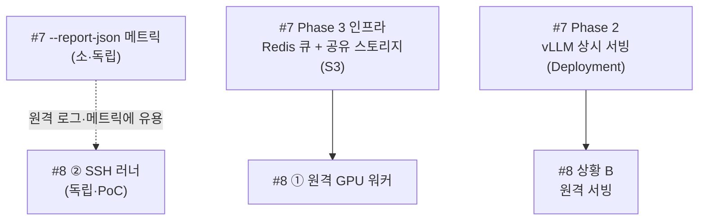

# 로드맵 · 현황 · 이슈 의존 관계

프로젝트의 현재 상태를 한눈에 정리하고, 열린 이슈(#7 API 로드맵, #8 원격 unsloth)의
**선행/의존 관계와 권장 진행 순서**를 명확히 합니다.

- 갱신 기준: PR #6(API MVP + 구조 재편) 시점
- 관련 문서: [api_design.md](api_design.md) · [remote_unsloth.md](remote_unsloth.md) ·
  [project_structure.md](project_structure.md)

---

## 1. 현재 상태 (완료됨)

| 영역 | 내용 | 상태 |
|---|---|---|
| 지식 파이프라인 | CPT → SFT → 병합 → 테스트 | ✅ (기존) |
| 선호 학습 | DPO / ORPO / KTO | ✅ (기존) |
| 툴 호출 | 데이터 생성 + 전용 학습 (tool) | ✅ PR #1 |
| 계획수립 | 데이터 생성 + 전용 학습 (plan) | ✅ PR #2 |
| 추론형 | 데이터 생성 + 전용 학습 (react) | ✅ PR #3 |
| 계획-실행 | 데이터 생성 + 전용 학습 (planact) | ✅ PR #4 |
| API 설계 | docs/api_design.md | ✅ PR #5 |
| API Phase 1(MVP) | FastAPI 비동기 Job 게이트웨이 | ✅ PR #6 |
| scripts 패키지 재편 | 역할별 하위폴더 + 문서 | ✅ PR #6 |
| 원격 unsloth 설계 | docs/remote_unsloth.md | ✅ PR #6 |
| 구조화 메트릭 (`--report-json`) | 전 스크립트 결과 JSON + 러너 수집 | ✅ #7 |
| SSH 러너 (#8②) | rsync 푸시/풀 + ssh 원격 실행 | ✅ #8② |
| 원격 GPU 워커 (#8①) | 공유 큐 + 역할 게이팅 워커 프로세스 | 🔄 PR #11 (열림) |
| 실시간 진행률 (`--progress-json`) | 스텝 단위 진행률 + SSE progress | 🔄 #9 (본 작업) |

> 학습 5단계(tool/plan/react/planact + 지식 CPT/SFT)와 그 데이터 생성기가 모두 갖춰졌고,
> 이를 감싼 API MVP와 폴더 재편·설계 문서가 PR #6에 모여 있습니다.
> (실제 GPU 학습 실행 검증은 이 저장소 환경에 GPU·unsloth가 없어 제외 — 데이터·API·구조는 검증됨.)

---

## 2. 열린 이슈

- **#7 — API 다음 단계 로드맵**: `--report-json` 메트릭 · Phase 2(vLLM 상시 서빙) ·
  생성 견고성 · Phase 3(Celery/RQ+Redis, 다중 GPU, S3, 멀티테넌시).
- **#8 — 원격 unsloth(GPU) 배포 지원**: ①원격 GPU 워커 · ②SSH 러너 · ③관리형 스케줄러.

---

## 3. 이슈 의존 관계 (핵심)

### 결론 먼저
- **#8은 #7의 선행조건이 아닙니다.** #7 항목들은 원격 unsloth 없이 현재 단일 노드에서
  그대로 진행할 수 있습니다.
- **반대로 #8의 권장안 ①(원격 GPU 워커)은 #7 Phase 3 인프라와 겹칩니다** — 즉
  #7 Phase 3(공유 큐 Redis + 공유 스토리지 S3)가 #8①의 **선행/공동 작업**입니다.
- **#8②(SSH 러너)는 완전히 독립적** — 어디에도 종속되지 않아 **가장 먼저** PoC로 가능.
- **#8 상황 B(원격 서빙)는 #7 Phase 2(vLLM Deployment)와 연계**됩니다.

### 의존 그래프

- 실선(→) = 선행 필요. 점선 = 도움되나 필수 아님.
- **#8①** 은 **#7 Phase 3** 를 선행/공동으로 요구(같은 큐·스토리지 인프라).
- **#8 상황 B** 는 **#7 Phase 2** 위에서 동작.
- **#8②·#7 --report-json** 은 아무 선행 없이 즉시 착수 가능.

---

## 4. 권장 진행 순서

| 순서 | 작업 | 근거 |
|---|---|---|
| 1 | **#7 `--report-json` 메트릭** | 작고 독립적·효과 큼. 이후 원격 로그/메트릭에도 재사용 |
| 2 | **#8 ② SSH 러너 (PoC)** | 독립적·저비용으로 원격 학습 실행을 조기 검증 |
| 3 | **#7 Phase 3 인프라 + #8 ① 원격 워커** | 같은 인프라(Redis 큐 + 공유 스토리지)를 공유 → 함께 |
| 4 | **#7 Phase 2 vLLM + #8 상황 B 원격 서빙** | 서빙 계층을 함께 원격화 |
| 5 | 생성 견고성 · 멀티테넌시/쿼터 · 웹 콘솔 (#7 잔여) | 운영 성숙화 |

> 요약: **먼저 `--report-json` → SSH PoC**(빠른 확인) → **원격 워커는 #7 Phase 3와 묶어**
> 진행. #8 전체가 #7의 선행은 아니며, #8①만 #7 Phase 3에 의존합니다.

---

## 5. 열린 항목 요약

- **PR #6** (열림): API MVP + scripts 재편 + 원격 unsloth 설계. 머지 시 위 "현재 상태"가 확정됩니다.
- **Issue #7 / #8** (열림): 위 순서대로 개별 PR로 착수. 방향(각 이슈의 결정사항)이 정해지면 진행.
